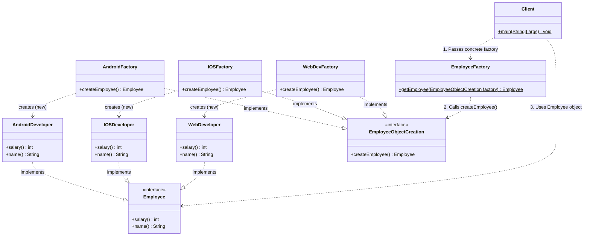
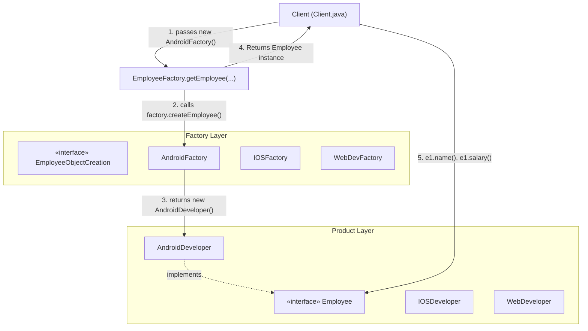

# Abstract Factory / Factory Method Design Pattern

## 📌 1. What is the Abstract Factory Design Pattern?

### 🔹 Formal Definition (GoF)
> A **Creational Design Pattern** that provides an interface for creating **families of related or dependent objects** without specifying their concrete classes.

### 🔹 Simple 1-Line Definition
> **"A Factory of Factories that creates objects without tying your code to specific concrete classes."**

---

## 🏢 2. Real-World Analogy (Tech Team Hiring)
Imagine building different technology teams:
- **Mobile Team Factory:** Hires an `AndroidDeveloper` + `MobileTester`.
- **Web Team Factory:** Hires a `WebDeveloper` + `WebTester`.
- **Apple Team Factory:** Hires an `IOSDeveloper` + `IOSTester`.

The client company just asks a specific **Team Factory** to assemble a team without worrying about individual developer/tester hiring and onboarding logic.

---

## 🎯 3. Why Did We Move From Simple Factory to This Pattern?

| Feature | Simple Factory | Factory Method / Abstract Factory |
| :--- | :--- | :--- |
| **Object Creation** | Single class with `switch-case` | Dedicated factory classes implementing an interface |
| **Open-Closed Principle (OCP)** | ❌ **Violated** (must edit switch) | ✅ **Followed** (add new factory subclass) |
| **Coupling** | Client decoupled from products, but coupled to single factory | Fully decoupled through interfaces |
| **Extensibility** | Low (hardcoded types) | High (plugin architecture friendly) |

---

## 🏗️ 4. Code Architecture & Role of Each Class

| Class / Interface | Role | Responsibility |
| :--- | :--- | :--- |
| `Employee` | **Product Interface** | Defines `salary()` and `name()` for all developer types. |
| `AndroidDeveloper` | **Concrete Product** | Implements `Employee` for Android role ($50,000). |
| `IOSDeveloper` | **Concrete Product** | Implements `Employee` for iOS role ($70,000). |
| `WebDeveloper` | **Concrete Product** | Implements `Employee` for Web role ($60,000). |
| `EmployeeObjectCreation` | **Abstract Factory Interface** | Declares the factory method `createEmployee()`. |
| `AndroidFactory` | **Concrete Factory** | Instantiates and returns `new AndroidDeveloper()`. |
| `IOSFactory` | **Concrete Factory** | Instantiates and returns `new IOSDeveloper()`. |
| `WebDevFactory` | **Concrete Factory** | Instantiates and returns `new WebDeveloper()`. |
| `EmployeeFactory` | **Factory Provider / Helper** | Static helper `getEmployee(EmployeeObjectCreation factory)` that delegates creation. |
| `Client` | **Consumer** | Supplies the desired factory and receives the polymorphic `Employee` object. |

---

## 📊 5. Mermaid Diagrams

### UML Class Diagram

### Flow / Step-by-Step Diagram

---

## 🚀 6. How Adding a New Employee Type Works (Zero Modification to Existing Code)

To add **`DevOpsDeveloper`**:
1. Create `DevOpsDeveloper implements Employee`.
2. Create `DevOpsFactory implements EmployeeObjectCreation`.
3. In `Client`, call `EmployeeFactory.getEmployee(new DevOpsFactory())`.

> ✅ **No existing class is modified!** This is a 100% pure implementation of the **Open-Closed Principle (OCP)**.

---

## ⚖️ 7. Key Distinction: Factory Method vs. Abstract Factory

| Concept | Factory Method | Abstract Factory |
| :--- | :--- | :--- |
| **Number of Products** | **Single Product** (`createEmployee()`) | **Family of Products** (`createDeveloper()` + `createTester()`) |
| **Pattern Mechanism** | Uses **Inheritance / Subclasses** | Uses **Object Composition** (Factory of Factories) |
| **When to Use** | When a class doesn't know ahead of time which single subclass to instantiate. | When your system needs to be independent of how multiple related products are created. |

---

## 💡 8. Top Interview Cheatsheet

### Q1: How does this pattern satisfy SOLID principles?
> **Answer:**
> - **OCP (Open-Closed Principle):** New types are introduced by adding new classes without editing existing ones.
> - **DIP (Dependency Inversion Principle):** The client depends on abstract interfaces (`Employee`, `EmployeeObjectCreation`), not concrete classes.
> - **SRP (Single Responsibility Principle):** Object instantiation logic is separated from business domain logic.

### Q2: Why not just use `new AndroidDeveloper()` in the client?
> **Answer:** Direct instantiation creates tight coupling. If `AndroidDeveloper` constructor changes in the future (e.g. requires API keys, logging, or database connections), all client code breaks. With factory patterns, changes remain isolated inside the factory.
