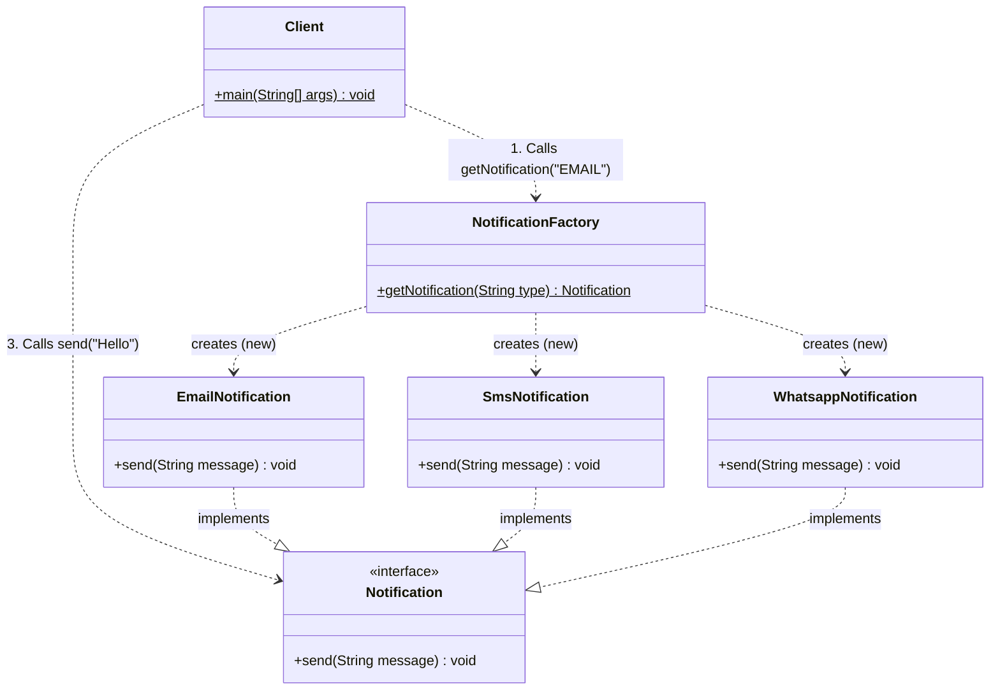
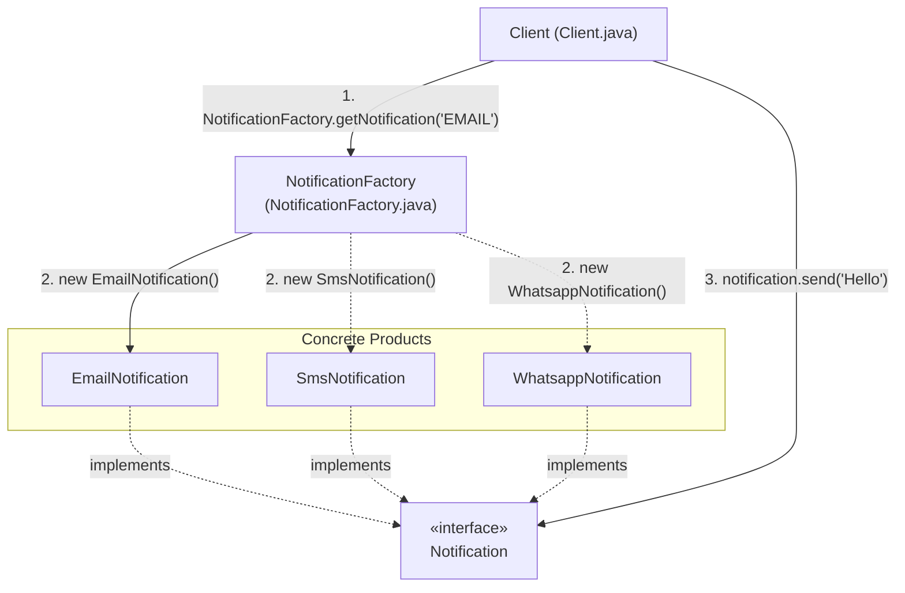

# Factory Design Pattern (Simple Factory)

## 📌 1. What is the Factory Design Pattern?

### 🔹 Formal Definition
> A **Creational Design Pattern** that provides an interface or class for creating objects without exposing the instantiation logic (`new ConcreteClass()`) to the client, allowing the client to refer to newly created objects through a common interface.

### 🔹 Simple 1-Line Definition
> **"Instead of creating an object directly with `new`, you ask a Factory to create and return it for you."**

---

## ☕ 2. Real-World Analogy (Coffee Machine)
- **Without Factory (You do everything):** You grind beans, boil water, froth milk, and measure sugar.
- **With Factory (Coffee Machine / Barista):** You simply press `"Cappuccino"`. The machine handles all complexity, preparation, and delivers your coffee. You don't need to know the inner workings of the machine.

---

## 🎯 3. Why Do We Use It? (Benefits)
1. **Encapsulates Object Creation Complexity:** Hides configuration, parameter setup, dependency injection, and validations from the client.
2. **Promotes Loose Coupling:** The `Client` only depends on the abstraction (`Notification` interface), not on concrete implementations (`EmailNotification`, `SmsNotification`, etc.).
3. **Single Responsibility Principle (SRP):** Object creation logic is kept in one place instead of scattered across the entire codebase.

---

## 🏗️ 4. Code Architecture & Role of Each Class

| Class / Interface | Role | Responsibility |
| :--- | :--- | :--- |
| `Notification` | **Product Interface** | Defines the contract `send(String message)` for all notification types. |
| `EmailNotification` | **Concrete Product** | Implements `Notification` with Email sending logic. |
| `SmsNotification` | **Concrete Product** | Implements `Notification` with SMS sending logic. |
| `WhatsappNotification` | **Concrete Product** | Implements `Notification` with WhatsApp sending logic. |
| `NotificationFactory` | **Simple Factory** | Uses `switch-case` to instantiate and return the right `Notification` object based on input. |
| `Client` | **Consumer** | Asks `NotificationFactory` for a notification object and calls `send()`. |

---

## 📊 5. Mermaid Diagrams

### UML Class Diagram


### Execution Flow Diagram


---

## ⚠️ 6. The Major Drawback: Violation of Open-Closed Principle (OCP)

In **Simple Factory**, all object creation logic is centralized inside a single `switch-case` in `NotificationFactory`:

```java
switch (type.toUpperCase()) {
    case "EMAIL": return new EmailNotification();
    case "SMS": return new SmsNotification();
    case "WHATSAPP": return new WhatsappNotification();
    // ❌ To add "FACEBOOK", we MUST modify this class!
}
```

- **Problem:** When business requires a new channel (e.g., `FacebookNotification`), we must **modify** the existing `NotificationFactory` class.
- **OCP Rule:** *"Software entities should be open for extension, but closed for modification."*
- **Solution:** Upgrade to **GoF Factory Method Pattern** or **Abstract Factory Pattern**, where each product has its own factory class.

---

## 💡 7. Top Interview Questions & Answers

### Q1: What problem does Factory Pattern solve?
> **Answer:** It solves tight coupling between the client and concrete classes by abstracting and centralizing the instantiation process behind an interface.

### Q2: What is the difference between Simple Factory and Factory Method?
> **Answer:**
> - **Simple Factory:** A single concrete class with a `switch` statement that creates all products (violates OCP).
> - **Factory Method:** Uses inheritance; defines an interface/abstract class for creation and lets subclasses decide which concrete class to instantiate (follows OCP).
