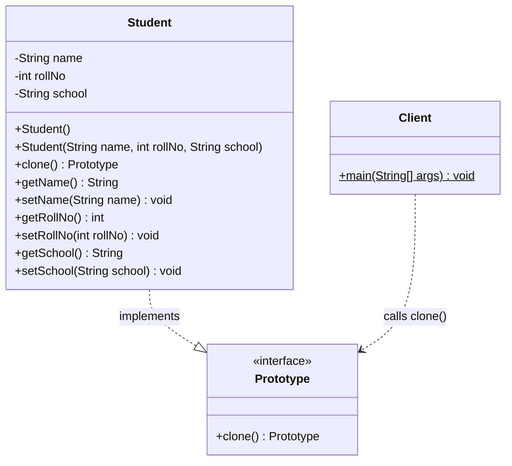
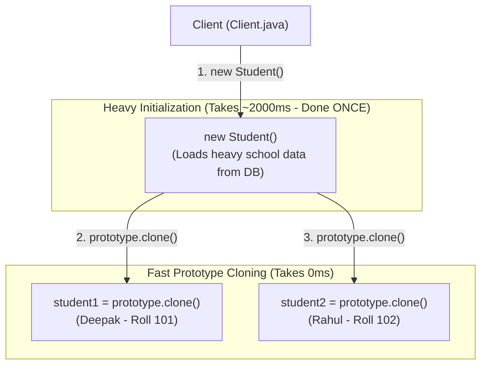

# Prototype Design Pattern

## 📌 1. What is the Prototype Design Pattern?

### 🔹 Formal Definition (GoF)
> A **Creational Design Pattern** that allows you to copy or clone existing objects without making your code dependent on their concrete classes or repeating expensive initialization processes.

### 🔹 Simple 1-Line Definition
> **"Instead of creating a new object from scratch (which is heavy/expensive), you clone an existing prototype object in memory."**

---

## ⚡ 2. The Problem It Solves

Suppose creating a `Student` object requires:
- Loading curriculum, school rules, and accreditation from a database (takes ~2 seconds).

If we have 1,000 students, creating each one using `new Student()` would take **1000 × 2s = 2000 seconds (over 30 minutes!)**.

### The Prototype Solution:
1. Run the heavy constructor **only once** to create a base `Prototype` object.
2. For every other student, **clone the prototype** (takes **0 ms**).

---

## 🏗️ 3. Code Architecture & Role of Each File

| File | Role | Responsibility |
| :--- | :--- | :--- |
| [Prototype.java](file:///Users/deepakkumarsingh/Desktop/System-Design/CreationalDesignPattern/PrototypeDesignPattern/Prototype.java) | **Prototype Interface** | Declares the `clone()` method contract. |
| [Student.java](file:///Users/deepakkumarsingh/Desktop/System-Design/CreationalDesignPattern/PrototypeDesignPattern/Student.java) | **Concrete Prototype** | Heavy work in main constructor; fast cloning in `clone()` method. |
| [Client.java](file:///Users/deepakkumarsingh/Desktop/System-Design/CreationalDesignPattern/PrototypeDesignPattern/Client.java) | **Consumer** | Creates 1 prototype, then clones instances instantly. |

---

## 📊 4. Mermaid Diagrams

### UML Class Diagram

### Execution Flow Diagram

---

## 💡 5. Top Interview Questions & Answers

### Q1: Why use a custom `Prototype` interface instead of Java's `Cloneable`?
> **Answer:** 
> - Java's `Cloneable` is a marker interface (has no methods). `Object.clone()` is `protected` and throws checked `CloneNotSupportedException`.
> - A custom `Prototype` interface (or copy constructor) is **type-safe**, explicit, and avoids checked exception clutter.

### Q2: When should you use the Prototype Pattern?
> **Answer:**
> 1. When creating an object from scratch is **resource-heavy / slow** (DB queries, network calls, complex calculations).
> 2. When multiple objects share identical base configurations with only minor customized fields.
