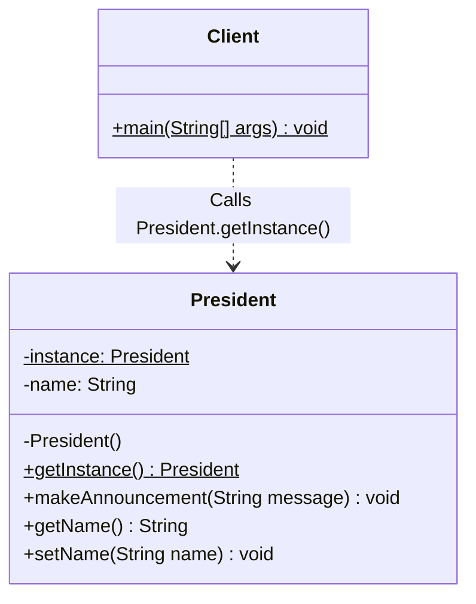
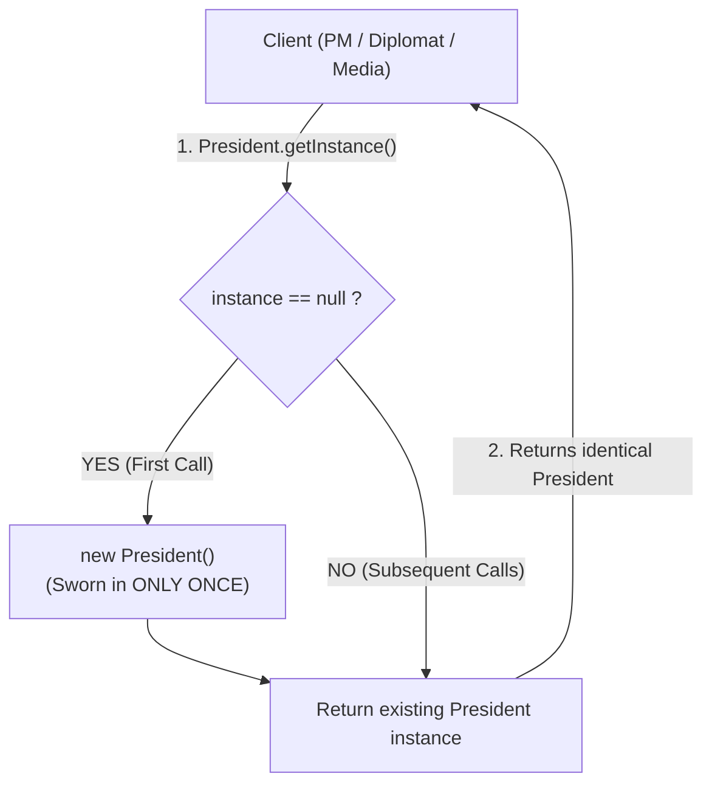

# Singleton Design Pattern

## 📌 1. What is the Singleton Design Pattern?

### 🔹 Formal Definition (GoF)
> A **Creational Design Pattern** that ensures a class has **only one instance** throughout the application's lifecycle and provides a **global point of access** to that instance.

### 🔹 Simple 1-Line Definition
> **"Only ONE object of the class can ever be created in memory."**

---

## 🏛️ 2. Real-World Analogy (The President of a Country 🇮🇳)
- In a country, there can only be **one official President** in office at any time.
- Whether the **Prime Minister**, a **Foreign Diplomat**, or the **Public Media** requests an audience with the President, they all interact with the **exact same President**.
- No one can create their own "new President" using `new President()`.

---

## 🔑 3. The Three Golden Rules of Singleton

Every Singleton implementation in Java MUST have:
1. **Private Constructor:** Blocks any external class from doing `new President()`.
2. **Private Static Variable:** Holds the single instance in memory (`private static volatile President instance;`).
3. **Public Static Accessor Method (`getInstance()`):** Provides global access to that single instance.

---

## 🏗️ 4. Code Architecture & Role of Each File

| File | Role | Responsibility |
| :--- | :--- | :--- |
| [President.java](file:///Users/deepakkumarsingh/Desktop/System-Design/CreationalDesignPattern/SingletonDesignPattern/President.java) | **Singleton Class** | Private constructor, thread-safe `getInstance()` with Double-Checked Locking. |
| [Client.java](file:///Users/deepakkumarsingh/Desktop/System-Design/CreationalDesignPattern/SingletonDesignPattern/Client.java) | **Consumer** | Multiple callers request `President.getInstance()` and verify they get the same instance. |

---

## 📊 5. Mermaid Diagrams

### UML Class Diagram


### Execution Flow Diagram


---

## ⚡ 6. Ways to Implement Singleton in Java

### 1. Lazy Initialization with Double-Checked Locking (Thread-Safe)
Creates the instance only when `getInstance()` is called for the first time.
```java
public class President {
    private static volatile President instance;

    private President() {}

    public static President getInstance() {
        if (instance == null) {
            synchronized (President.class) {
                if (instance == null) {
                    instance = new President();
                }
            }
        }
        return instance;
    }
}
```

### 2. Eager Initialization
Instance is created as soon as the class is loaded by JVM.
```java
public class President {
    private static final President instance = new President();
    private President() {}
    public static President getInstance() { return instance; }
}
```

### 3. Enum Singleton (Effective Java by Joshua Bloch)
Best defense against Reflection and Serialization attacks.
```java
public enum President {
    INSTANCE;
    public void makeAnnouncement(String message) {
        System.out.println("Announcement: " + message);
    }
}
```

---

## 💡 7. Top Interview Questions & Answers

### Q1: Why is the `volatile` keyword used in Double-Checked Locking?
> **Answer:** `volatile` prevents CPU instruction reordering, guaranteeing that the object is fully constructed in memory before the memory address is published to `instance`.

### Q2: How can a Singleton be broken, and how do you prevent it?
> **Answer:**
> 1. **Reflection:** Can access private constructors (`constructor.setAccessible(true)`).
>    - *Fix:* Throw an exception in constructor if `instance != null`, or use `Enum`.
> 2. **Serialization / Deserialization:** Creates a new object upon deserialization.
>    - *Fix:* Implement `readResolve()` method to return `getInstance()`.
> 3. **Cloning:** If class implements `Cloneable`.
>    - *Fix:* Override `clone()` and throw `CloneNotSupportedException`.
